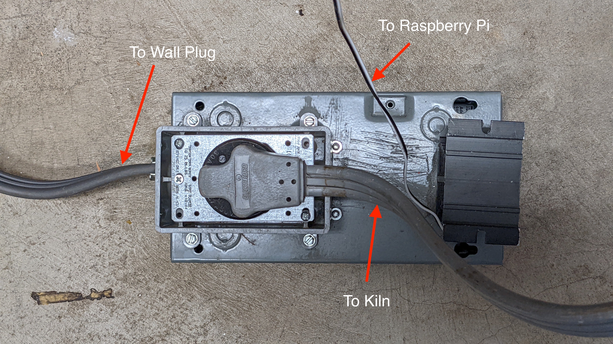

# kilntrol
Raspberry pi automatic kiln controller and graphical viewer (via google sheets).

Uploading to google sheets requires google api python client:
`pip install --upgrade google-api-python-client`

Start the controller and log uploader by running `./start`

## Requirements
For kilntrol you'll need:
- a kiln
- a raspberry pi with python >= 3.6
- a type K thermocouple
- a [MAX31855 breakout board](https://www.adafruit.com/product/269) for reading the thermocouple. Here's some additional [useful reading](https://learn.adafruit.com/thermocouple) on that.
- a relay capable of switching whatever voltage and current your kiln needs 

For uploading temperature logs to google sheets you'll need:
- The dependecies installed: `pip3 install --upgrade google-api-python-client google-auth-httplib2 google-auth-oauthlib`

## setup
Wire up your raspberry pi and max30855 like this 

Install Raspberry Pi OS Lite on the SD card and configure it with your wifi info and ssh enabled.  This is easiest with [Raspberry Pi Imager](https://www.raspberrypi.com/software/). Hint: before flashing press ctrl-shift-X to bring up advanced options to set up your wifi, hostname, and ssh access.

Insert the SD card and boot your pi. Ssh to the pi (e.g. if you set the hostname to 'kiln.local' in the above step then `ssh pi@kiln.local`). Install git and dependencies, an clone the repo:
```
sudo apt install git python3-pip
pip3 install --upgrade google-api-python-client google-auth-httplib2 google-auth-oauthlib
git clone https://github.com/bjornicus/kilntrol.git
```

## running
Cd into the kilntrol directory, choose the profile you want to run and start kilntrol with that profile. For example, to run the short test profile: 
```
python3 src/kilntrol.py -p test-profile-short.json
```
Then start the log uploader:
```
python3 src/upload_logs.py 
```
Visit the URL and complete the app authorization, then paste the code it gives back into the `Enter the authorization code:` prompt.

TODO: how to set up a google sheet for users other than me?

you can watch the current state of the kiln with:
```
tail -f logs/temperature.log
```


## Similar projects
Jason Bruce's [Kiln Controller](https://github.com/jbruce12000/kiln-controller) project uses basically the same hardware setup, has better documentation and more contributors and some other fancy features.  